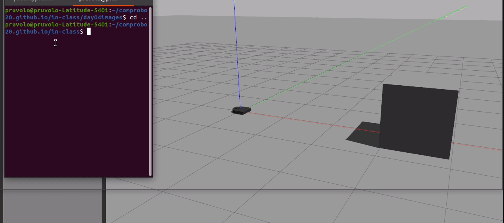

## Today
* Proportional Control and ROS Parameters
* Studio Time

## For Next Time
* Work on the <a-no-proxy href="../assignments/warmup_project" data-canvas="https://olin.instructure.com/courses/143/assignments/440">the Warmup Project</a-no-proxy> (due next Monday, the 28th).


## Proportional Control

So far we've programmed robots to choose between a small set of motor commands (move forward, stop, etc.) based on sensor readings.  Today, we will be experimenting with setting the the motor command  proportional to the error between the robot's current position and the desired position.

To get the idea, program the Neato to adjust its position so that it is a specified (target) distance away from the wall immediately in front of it.  The Neato's forward velocity should be proportional to the error between the target distance and its current distance.  Note: it's tricky to get the sign correct, run through a few mental simulations to make sure the robot will move in the right direction.

> If you're still a bit fuzzy on how to structure your code in ROS we have provided some starter code (look for ``wall_approach_starter.py`` in the ``in_class_day04_sample/scripts`` folder.

A helpful tool for visualizing the results of your program is to use the <a-no-proxy href="http://wiki.ros.org/rqt/UserGuide">rqt_gui tool</a-no-proxy>.  First, start up the GUI:

```bash
$ rqt
```

Next, go to ``plugins -> visualization -> plot``.

Type ``/scan/ranges[0]`` (if that is in fact what you used to calculate forward distance) into the topic field and then hit +.

### Getting Fancy

To make your node more configurable, use (see the [rosparam documentation on ROS wiki](http://wiki.ros.org/rospy/Overview/Parameter%20Server) for more information).  For instance, if you want to make the target_distance configurable, consider launching your node like this:

```bash
$ rosrun  in_class_day04 wall_approach.py _target_distance:=1.5 _k:=0.5
```

To access the parameter inside of your Python code use:

```bash
target_distance = rospy.get_param('~target_distance')
```

Here is a demo of our script, ``wall_approach_fancy.py`` that uses ROS parameters as well as the tool [``dynamic_reconfigure``](http://wiki.ros.org/dynamic_reconfigure/Tutorials) for easy manipulation of various node parameters.  You can find ``wall_approach_fancy`` in the ``comprobo20`` upstream repo in the package ``in_class_day04_sample``.

.
