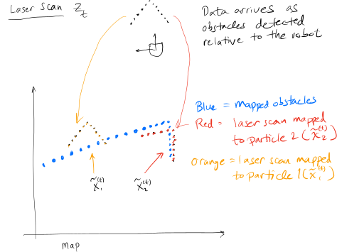

## Today

* Laser scan likelihood functions
* Project work time

## Laser scan likelihood functions

Remember that one step of our particle filter is to reweight each particle based on how well the laser scan "fits" with a map.  More precisely, we had the following equation to compute the weight of the $$i$$th particle.

$$w_i = \frac{p\left(z_t | x_t=\tilde{x}^{(t)}_i\right)}{\sum_{j=1}^m p\left(z_t | x_t=\tilde{x}^{(t)}_j\right)}$$

Where in the preceding equation $$\tilde{x}^{(t)}_i$$ was the $$i$$th particle at the $$t$$th step after applying the motor model update.

In order to make sense of the preceding equation, we will need some idea of how to the conditional probability (the probability of the sensor data given a potential pose of the robot).

### General approach

For a particular laser scan, each particle prescribes a different mapping from the robot-centric coordinate of the laser scan to the coordinate system of the map.

From the figure above we can intuit that the laser scan data we received would probably be more likely if we were at particle 2 versus particle 1, but how do we assign a number to this idea?

The typical approach to the problem is to think about the various causes that could explain a particle laser scan measurement.  As an example, let's consider the case where we detect an obstacle directly in front of the robot at a distance of $$2$$ meters.  Here are some possible causes that could explain this observation.
1. The laser scanner intersected an obstacle from our map (this is the ideal scenario as it would provide great information to help us localize the robot).  Probably there is some measurement noise as well.
2. The laser scanner intersected an object that we didn't have have in our map (this is likely to confuse our attempts to localize).
3. The laser scanner didn't return any data at a particular angle
4. The laser scanner returned some sort of random measurement (it's hallucinating).

When we determining the likelihood of our laser scan measurement we might consider what the likelihood of the data would be under each of these cases.  The overall likelihood could then be constructed as a weighted average of each of the likelihood functions.

In order to dig into (2)-(4), we will refer you to [these detailed notes](http://ais.informatik.uni-freiburg.de/teaching/ss10/robotics/slides/07-sensor-models.pdf) (start looking on slide 8).  In order to figure out the probability of a laser scan measurement if it did indeed contact an object, consider the following picture (remember we are considering the case where the laser scanner returns a reading of $$2$$ meters directly in front of it).

As you can see from the graph, the probability that we read off from the second particle is higher than the one we read off from the first.  This should make sense since the scan projected from the second particle is a closer match to the map than the scan projected from the first particle.

### Scan-based models (likelihood field)

The main difference with a scan-based model versus a beam model is that you directly compare the scan to the detected map and decide how close it is.  We skip over the step of determining where we *should* have seen an obstacle given a particle and a laser scan reading.  In a likelihood field model, the probability of a scan given a position and orientation in the map is based on how closely the end point of the scan matches a known obstacle in the map.  Returning to our example from before, we would measure the distance of the point $$2$$ meters in front of each particle to the closest obstacle in the map and then compute the probability of that distance.  A very close match (distance close to 0) would give a higher probability than a match that is not that close (distance much greater than 0).  Consult the notes linked earlier in this document for some more detail on specific ways to do that (or ask us directly!).

### Combining multiple measurements

## For Next Time

* Keep working on the particle filter project
