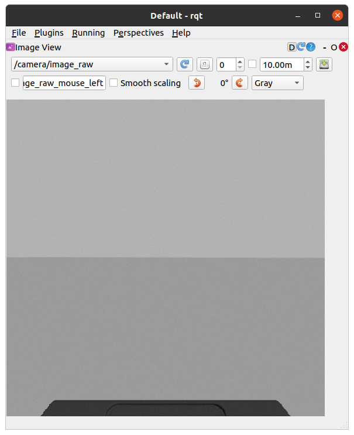
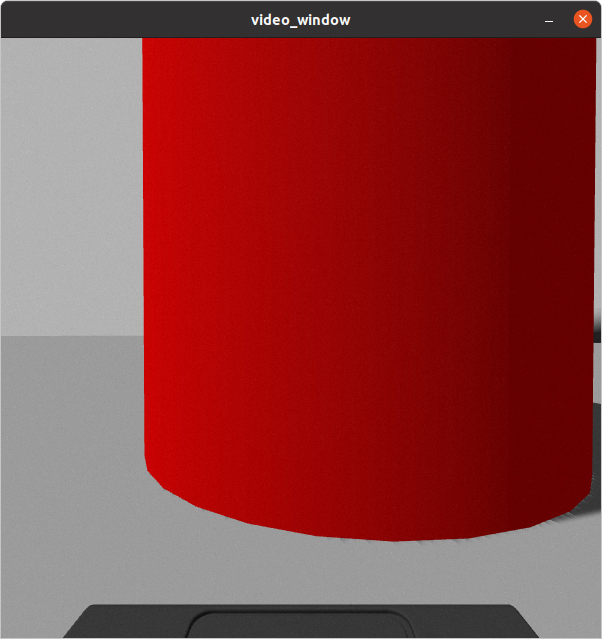

## Today

* Robots and society discussion
* Meet with an instructor regarding your project proposal (one of us will drop into your breakout room)
* Neato soccer

## For Next Time

* Keep on working on the comptuer vision project
* Reading materials for discussion on environmental impact of robotics:
   * <a-no-proxy href="https://theconversation.com/if-robots-take-our-jobs-what-will-it-mean-for-climate-change-123507"> Reading #1: If robots take our jobs what will it mean for climate change? </a-no-proxy>
   * <a-no-proxy href="https://www.iisd.org/articles/automation-environment"> Reading #2: What Effect Will Automation Have on the Environment? </a-no-proxy>
   * Optional (but cool) readings: 
      * <a-no-proxy href="https://time.com/4476614/self-driving-cars-environment/"> Self-Driving Cars </a-no-proxy> 
      * <a-no-proxy href="https://exchange.telstra.com.au/skygrow-muru-d-climate-change/"> Tree Planting Robots </a-no-proxy> 
      * <a-no-proxy href="https://www.youtube.com/watch?v=CVdPhUPO5YU"> Robots to Fighting Pollution </a-no-proxy>

## Robots and Society Discussion

James will be leading us through this. <a-no-proxy href="https://pasteapp.com/p/AeIAWd3HpVx?view=fhmWGJbzAMo"> Slides available here </a-no-proxy>.

## Neato Soccer (or maybe Neato Hockey)

In the ``comprobo20`` repository, run ``$ git pull upstream master`` to get the starter code for today.

The starter code for today will be in ``~/catkin_ws/src/comprobo20/neato_soccer/ball_tracker.py``.

The starter code currently subscribes to an image topic, and then uses the ``cv_bridge`` package to convert from a ROS message to an OpenCV image.

An OpenCV image is just a numpy array.  If you are not familiar with numpy, you may want to check out these tutorials: numpy quickstart, numpy for matlab users.

Before running the starter code, you'll have to startup the Neato simulator.  Since we are going to be using computer vision for tracking the ball, you'll want to make sure that you start the simulator with the camera option.

```bash
$ roslaunch neato_gazebo neato_empty_world.launch load_camera:=true
```

You can visualize the images coming from the camera using ``rqt_gui``.  First launch ``rqt_gui``.

```bash
$ rosrun rqt_gui rqt_gui
```

Next, go to ``Plugins``, then ``Visualization``, and then select ``Image View``.  Select ``/camera/image_raw`` from the drop down menu. If you did this properly you should see the following on your screen.




Once you've started the simulator, you'll need to create some sort of ball or puck for your robot to kick around.  We've found that this will probably work a bit better as neato hockey than neato soccer, so we suggest you perform the following steps.

<ol>
<li>Start model editor by clicking <tt>edit</tt> and then <tt>model editor</tt>


</li>
<li>Insrt a cylinder into the scene by clicking on the cylinder shape on the left menu.


</li>
<li>Start the link editor by right clicking on the cylinder and selecting <tt>link editor</tt>.</li>
<li>Change the color by selecting a different material (<a href="http://wiki.ros.org/simulator_gazebo/Tutorials/ListOfMaterials">materials list</a>).


</li>
<li>
Change the coefficient of friction (this will make it slide more like a hockey puck.

</li>

<li>
Save the model by first exiting the model editor, clicking <tt>save and exit</tt>, and then giving the model a name (it doesn't matter so much what it is).


</li> 

<li>Unpause the simulation to make sure you can still drive the robot around and you are getting new images.</li>
</ol>

Run the starter code and you'll see the dimensionality of the resultant ``numpy`` array as printed out in ``process_image``.  You'll notice that the encoding of the image is bgr8 which means that the color channels of the 600x600 image are stored in the order blue first, then green, then red.  Each color intensity is an 8-bit value ranging from 0-255.

If all went well, you should see an image that looks like this pop up on the screen.



> Note: a very easy bug to introduce into your opencv code is to omit the call to the function ``cv2.waitKey(5)``.  This function gives the OpenCV GUI time to process some basic events (such as handling mouse clicks and showing windows).  If you remove this function from the code above, check out what happens.

### Do some filtering based on color

Our first step towards finding the ball in the field of view of the camera (which will ultimately allow us to track it), is to filter the image based on the color values of the pixels.  We will be using the ``cv2.inRange`` function to create a binarized version of the image (meaning all pixels are either black or white) depending on whether they fall into the specified range.  As an example, here is some code that would create a binary image where white pixels would correspond to brighter pixels in the original image, and black pixels would correspond to darker ones

```python
        self.binary_image = cv2.inRange(self.cv_image, (128,128,128), (255,255,255))
```

This code could be placed inside of the ``process_image`` function at any point after the creation of ``self.cv_image``.  Notice that there are three pairs lower and upper bounds.  Each pair specifies the desired range for one of the color channels (remember, the order is blue, green, red).  If you are unfamiliar with the concept of a colorspaces, you might want to do some reading about them on Wikipedia.  Here is the link to the RGB color space (notice the different order of the color channels from OpenCV's BGR).  Another website that might be useful is this color picker widget that lets you see the connection between specific colors and their RGB values.

Your next goal is to choose a range of values that can successfully locate the ball.  In order to see if your ``binary_image`` successfully segments the ball from other pixels, you should visualize the resultant image using the ``cv2.namedWindow`` (for compatibility with later sample code you should name your window ``threshold_image``) and ``cv2.imshow`` commands (these are already in the file, but you should use them to show your binarized image as well).

> Super, super, super important: don't put the ``cv2.namedWindow`` or ``cv2.imshow`` inside the ``process_image`` function.  You can only call OpenCV functions that display graphical objects from your main thread (follow the template of what's already there). 

> Also important: white pixels will correspond to pixels that are in the specified range and black pixels will correspond to pixels that are not in the range (it's easy to convince yourself that it is the other way around, so be careful).

#### Debugging Tips

The first thing that might be useful is to display the color values for a particular pixel in the image as you hover your mouse over it.  To accomplish this, add the following line to your ``__init__`` function.  This lines will register a callback function to handle mouse events (the callback function will be inserted next, see below).

```python
        cv2.setMouseCallback('video_window', self.process_mouse_event)
```

Then add the callback function to process mouse events, use this code:

```python
    def process_mouse_event(self, event, x,y,flags,param):
        """ Process mouse events so that you can see the color values
            associated with a particular pixel in the camera images """
        image_info_window = 255*np.ones((500,500,3))
        cv2.putText(image_info_window,
                    'Color (b=%d,g=%d,r=%d)' % (self.cv_image[y,x,0], self.cv_image[y,x,1], self.cv_image[y,x,2]),
                    (5,50),
                    cv2.FONT_HERSHEY_SIMPLEX,
                    1,
                    (0,0,0))

        cv2.imshow('image_info', image_info_window)
        cv2.waitKey(5)
```

A second debugging tip is to use sliders to set your lower and upper bounds interactively.  In this page, I'll walk you through adding these using OpenCV, but you could also use ``dynamic_reconfigure`` as well.

To get started I'll walk you through making the lower bound for the red channel configurable using a slider.  First, add these lines of code to your ``__init__`` function.  This code will create a class attribute to hold the lower bound for the red channel, create the thresholded window, and add a slider bar that can be used to adjust the value for the lower bound of the red channel.

```python
        cv2.namedWindow('threshold_image')
        self.red_lower_bound = 0
        cv2.createTrackbar('red lower bound', 'threshold_image', 0, 255, self.set_red_lower_bound)
```

The last line of code registers a callback function to handle changes in the value of the slider (this is very similar to handling new messages from a ROS topic).  To create the call back, use the following code:

```python
    def set_red_lower_bound(self, val):
        """ A callback function to handle the OpenCV slider to select the red lower bound """

        self.red_lower_bound = val
```

All that remains is to modify your call to the ``inRange`` function to use the attribute you have created to track the lower bound for the red channel.   Remember the channel ordering!!!  In order to fully take advantage of this debugging approach you will want to create sliders for the upper and lower bounds of all three color channels.

If you find the video feed lagging on your robot, it may be because your code is not processing frames quickly enough.  Try only processing every fifth frame to make sure your computer is able to keep up with the flow of data.

### An Alternate Colorspace

Separating colors in the BGR space can be difficult.  To best track the ball, I recommend using the hue, saturation, value (or HSV) color space.  See the Wikipedia page for more information.  One of the nice features of this color space is that hue roughly corresponds to what we might color while the S and the V are aspects of that color.  You can make a pretty good color tracker by narrowing down over a range of hues while allowing most values of S and V through (at least this worked well for me with the red ball).

To convert your RGB image to HSV, all you need to do is add this line of code to your ``process_image`` function.

```python
        self.hsv_image = cv2.cvtColor(self.cv_image, cv2.COLOR_BGR2HSV)
```

Once you make this conversion, you can use the ``inRange`` function the same way you did with the BGR colorspace.  You may want to create two binarized images that are displayed in two different windows (each with accompanying sliders bars) so that you can see which works better.

### Dribbling the Ball

There are probably lots of good methods, but what we implemented was basic proportional control using the center of mass in the x-direction of the binarized image.  If the center of mass was in the middle 50% of the image we kept moving forward at a constant rate, if not, we rotated in place in order to move the ball into the middle 50% before moving forward again.

Tips:

<ul>
<li>To compute the center of mass in the x-direction, use the ``cv2.moments`` function.  You can easily code this in pure Python, but it will be pretty slow.  For example, you could add the following code to your <tt>process_image</tt> function.


        moments = cv2.moments(self.binary_image)
        if moments['m00'] != 0:
            self.center_x, self.center_y = moments['m10']/moments['m00'], moments['m01']/moments['m00']

</li>
<li>
When doing your proportional control, make sure to normalize <tt>self.center_x</tt> based on how wide the image is.  Specifically, you'll find it easier to write your proportional control if you rescale <tt>self.center_x</tt> to range from -0.5 to 0.5. We recommend sending the motor commands in the <tt>self.run</tt> function.

If you want to use the sliders to choose the right upper and lower bounds before you start moving, you can set a flag in your <tt>__init__</tt> function that will control whether the robot should move or remain stationary.  You can toggle the flag in your <tt>process_mouse_event</tt> function whenever the event is a left mouse click.  For instance if your flag controlling movement is <tt>should_move</tt> you can add this to your <tt>process_mouse_event</tt> function:


        if event == cv2.EVENT_LBUTTONDOWN:
            self.should_move = not(self.should_move)

</li>
</ul>
